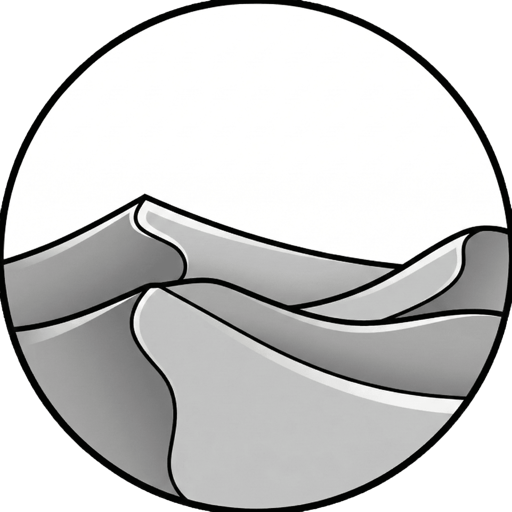

# Dune Weaver — Home Assistant integration

Local-polling Home Assistant integration for [Dune Weaver](https://github.com/tuanchris/dune-weaver)
kinetic sand tables running the **standalone ESP32 firmware**
(FluidNC fork, `dune-weaver-firmware`). Talks directly to the table's HTTP API —
no MQTT broker, no Raspberry Pi.

## Features

- **Auto-discovery** — tables advertise `model=dune-weaver` over mDNS and show up
  in Home Assistant automatically (manual IP entry as fallback).
- **Light** — the table's LED ring as a proper HA light: on/off, brightness,
  RGB color (read back from the table), and all firmware effects. Uses the
  firmware's live LED path, so it works while a pattern is drawing.
- **Full LED control** — the light covers the basics; the rest of the firmware's
  LED surface is exposed as its own entities (under the device's *Configuration*
  section): **palette**, animation **speed**, the machine-state **run/idle effect**
  hooks, and every `ball`-effect parameter (**direction, alignment, glow size,
  blob & background brightness, background sub-effect**). The one thing HA's light
  platform can't model — a **secondary color** — plus any of the above in a single
  call is available through the `dune_weaver.set_led` service.
- **Sensors** — table state, pattern progress (%), current pattern, active
  playlist (with index/total/pause attributes), plus diagnostics
  (last restart reason, uptime, free memory).
- **Playback** — `select` entities to **start a pattern or playlist** from the
  table's on-card library. The lists are fetched once and cached (they can be
  large); a **Refresh library** button re-reads them on demand.
- **Media player** — a playback card: play/pause/stop/next, the current pattern
  as the title, playlists as selectable sources, and the pattern library as a
  browsable folder tree (pick one to run it).
- **Buttons** — Home, Stop, Pause, Resume, Skip pattern, Stop playlist, and
  Refresh library.
- **Numbers** — base speed (mm/min) and live speed override (%), both applied
  mid-pattern.

State is polled from `GET /sand_status` every 2 s — the rate the firmware's
multi-client status route is designed for. The slower-changing LED/feed
settings (`GET /sand_settings`, the source for the palette/color/speed/ball
values that `/sand_status` doesn't report) are fetched once at startup and
re-read after each write, not on every poll.

## Requirements

- A table running `dune-weaver-firmware` (the standalone MKS-DLC32/ESP32 build).
  The Raspberry Pi-based Dune Weaver host is **not** supported by this
  integration (it has its own MQTT support).
- Home Assistant 2025.1 or newer.
- Firmware newer than v0.1.7 exposes the table's MAC address (in `/sand_status`
  and the mDNS TXT record); the integration uses it as the stable device ID, so
  a table added by IP and the same table found via discovery can't create
  duplicates, and DHCP address changes are followed automatically. Older
  firmware still works, just without that dedupe.

## Installation

### HACS (recommended)

1. HACS → three-dot menu → **Custom repositories**.
2. Add `https://github.com/tuanchris/dune-weaver-ha` as an **Integration**.
3. Install **Dune Weaver**, restart Home Assistant.

### Manual

Copy `custom_components/dune_weaver/` into your HA `config/custom_components/`
directory and restart.

## Setup

Discovered tables appear under **Settings → Devices & services** — just confirm.
To add one manually: **Add integration → Dune Weaver** and enter the table's IP
address (prefer the IP over `<host>.local` if mDNS is unreliable on your
network).

Automations can also start playback with the `dune_weaver.run_pattern`
(path + optional `clear` mode) and `dune_weaver.run_playlist` services — handy
for passing a path that isn't in the cached list.

## Roadmap

- Firmware update notifications from the `fw` status field (`update` entity).
